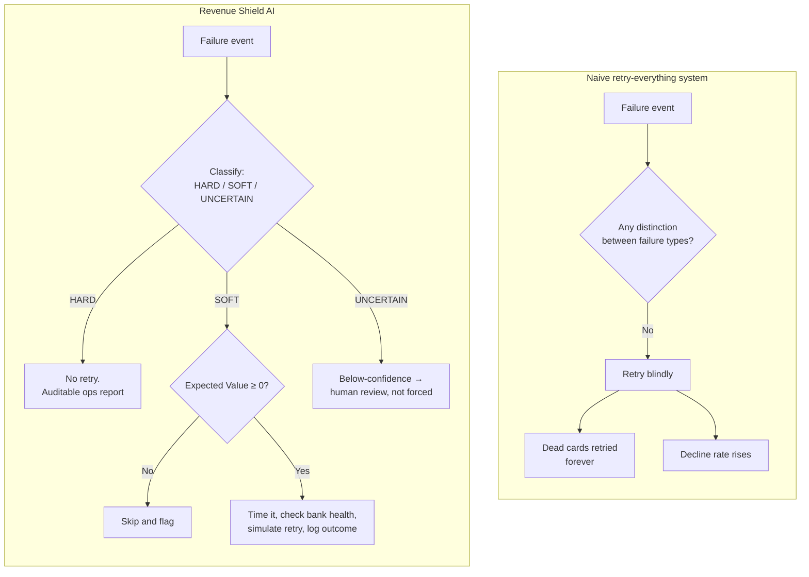
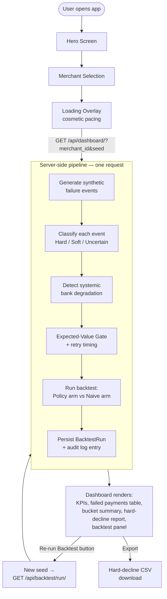
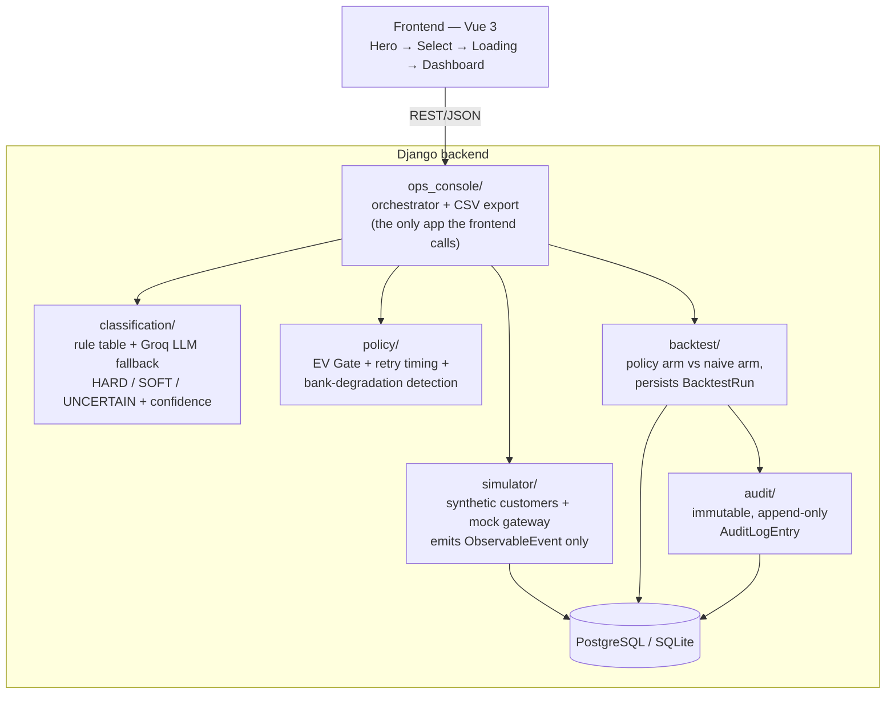
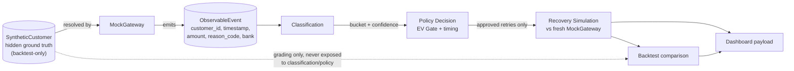
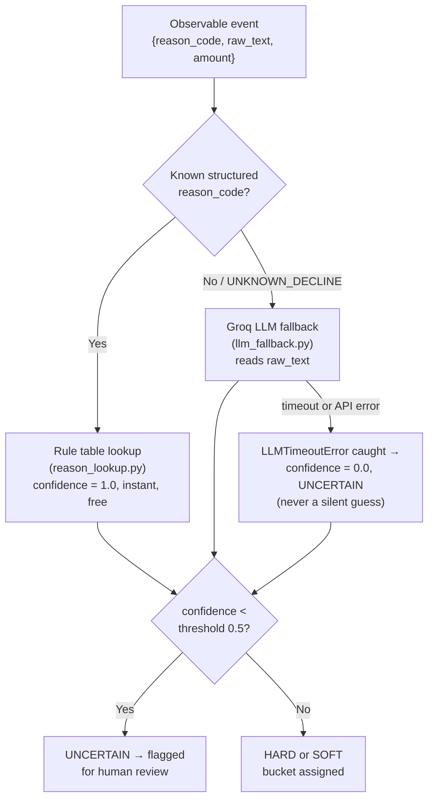
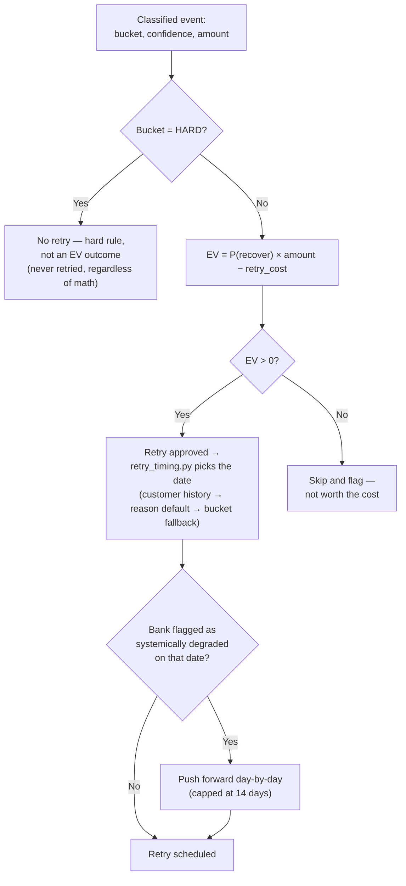
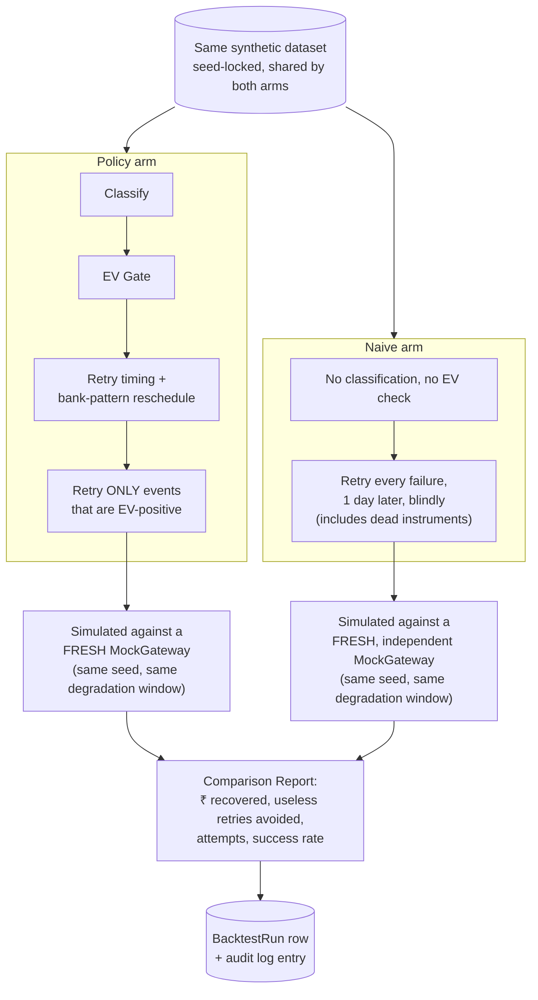

# Revenue Shield AI

An operational intelligence copilot that classifies failed recurring payments, decides whether a retry is economically worth attempting, and proves the decision's value with a live, re-runnable backtest against a naive baseline.

*Built for the Razorpay Ideathon 2026 — AI Revenue Recovery Track.*

---

## Problem Statement

Recurring payments in India — UPI AutoPay, e-mandates, subscription billing — fail at structurally high rates. The default handling almost every system falls back to is one flow for every failure:


This treats an expired card and a same-day network blip identically. Two costs follow:

- **Merchant side** — lost revenue, no visibility into *why* payments fail, no way to prioritize which failures are worth chasing.
- **Aggregator side** — retrying a permanently dead instrument (expired card, revoked mandate) doesn't just waste a retry attempt; it inflates the aggregator's decline rate, a metric banks and card networks track per aggregator.

There is no decision layer between *"payment failed"* and *"retry it."* Revenue Shield AI is that layer.

---

## Why Existing Systems Fail



---

## Solution Overview

**In business terms:** before spending a retry attempt, the system asks two questions — *is this actually recoverable*, and *is it worth the cost of trying*. Dead instruments (expired cards, revoked mandates) are reported for merchant/ops action instead of retried. Everything else is scored on expected value before a retry is scheduled.

**In technical terms:** a rule table classifies structured gateway reason codes for free; an LLM (Groq) is invoked only for the minority of unstructured/unknown reason text; an Expected-Value Gate (`P(recover) × amount − retry_cost`) decides whether a retry is scheduled; a cross-customer z-score scan detects when a bank is systemically degraded and reschedules around it; and a backtest engine re-runs both this policy and a naive "retry everything" baseline against the same synthetic dataset to produce a directly comparable ₹-recovered number.

The system never touches a live payment flow. It is advisory — it classifies, decides, and reports.

---

## End-to-End Product Flow

This is the actual frontend state machine (`App.vue`) plus what one API call (`GET /api/dashboard/`) triggers server-side.



Nothing on the dashboard is precomputed or hardcoded — every figure is produced by that one request, and pressing **Re-run Backtest** genuinely reruns the pipeline with a fresh seed.

---

## System Architecture

Seven Django apps, one of which (`ops_console`) is the only app the frontend talks to; it orchestrates the other six.



**Note on scope:** `audit/logger.py` provides `log_classification()` and `log_policy_decision()` helpers, but in the current wiring only `log_backtest_run()` is actually called (from `backtest.persist_backtest_run`). Per-event classification and EV-gate decisions are *not* currently written to the audit log during a live dashboard request — see [Limitations](#limitations).

---

## Data Flow Diagram

The core architectural rule of the codebase: `classification/` and `policy/` may only see `ObservableEvent` rows. `SyntheticCustomer` (the hidden ground truth — balance timeline, salary date, card/mandate validity) is queried only by the simulator itself and by the backtest, which needs it to grade outcomes.



---

## Classification Pipeline

Rule-first, LLM-fallback — not multi-model. Structured reason codes are the majority case and are resolved by a zero-cost lookup table; the LLM (Groq, `llama-3.1-8b-instant`) is called only when the reason code is `UNKNOWN_DECLINE` or otherwise unrecognized.



---

## Expected-Value Gate



`P(recover)` is a base rate per bucket (SOFT: 0.55, UNCERTAIN: 0.30 × confidence), overridden per reason code for SOFT declines (`INSUFFICIENT_FUNDS`: 0.60, `BANK_TIMEOUT`: 0.70, `NETWORK_ERROR`: 0.75). These are hand-set placeholder priors — the code documents itself as a "swap-in point" for rates learned from real retry-outcome data.

---

## Backtest Engine



Both arms are simulated against independently-constructed `MockGateway` instances seeded identically to the original dataset's gateway, so neither arm can "consume" stochastic luck meant for the other. The only thing that legitimately differs between the two arms is *which* events get retried and *when* — the two decisions the policy layer claims to make better than blind retrying.

---

## Component Responsibility Matrix

| Component | Purpose | Input | Output |
|---|---|---|---|
| `simulator/` | Generates synthetic customers with hidden ground truth; resolves payment attempts against that ground truth via a mock gateway | seed, customer count, months | `ObservableEvent` rows (never exposes ground truth) |
| `classification/` | Buckets each event as HARD / SOFT / UNCERTAIN | `ObservableEvent` dicts | `ClassificationResult` (bucket, confidence, source, reasoning) |
| `policy/` | Decides whether to retry (EV Gate), when (retry timing), and adjusts for bank-wide degradation | `ClassificationResult` + event's `bank` field | `PolicyDecision` (final retry date or none, audit trail) |
| `backtest/` | Runs the policy arm and a naive "retry everything" arm against the same dataset and compares recovered ₹ | seed, customer count, months, optional merchant filter | `BacktestReport`, persisted `BacktestRun` |
| `audit/` | Append-only log of decisions (rows are immutable by construction — `save()` rejects updates) | Objects from classification/policy/backtest | `AuditLogEntry` rows (currently only backtest runs are logged in the live flow) |
| `ops_console/` | Wires the pipeline together into one dashboard payload; exposes the only endpoints the frontend calls; builds hard-decline CSV export | HTTP query params (`merchant_id`, `seed`, etc.) | JSON dashboard payload / CSV file |
| `ingestion/` | Django app scaffold for accepting failure events in a webhook-like shape | — | Models only; no active views wired into the live pipeline |

---

## API Surface

| Endpoint | Method | Description |
|---|---|---|
| `/api/merchants/` | `GET` | Returns the 5 synthetic merchants (`MERCH_001`–`MERCH_005`) available for selection |
| `/api/dashboard/?merchant_id=&seed=&n_customers=&months=` | `GET` | Runs the full pipeline live — generate → classify → EV-gate → backtest — and returns the dashboard payload |
| `/api/backtest/run/?merchant_id=&seed=` | `GET` / `POST` | Powers "Re-run Backtest"; same pipeline, typically a fresh seed |
| `/api/hard-declines/export?merchant_id=&seed=` | `GET` | Downloadable CSV of HARD-bucket customers (`customer_id`, `payment_amount`, `failure_reason`, `confidence`, `recommended_action`) |

Query defaults: `seed=42`, `n_customers=200`, `months=4`. `merchant_id` is optional — omitting it runs the pipeline platform-wide across all synthetic merchants.

The frontend (`services/api.js`) calls these endpoints and falls back to a lightweight, clearly-labeled client-side simulator (`services/simulator.js`) if the backend is unreachable, so the demo UI doesn't hard-crash on a network blip during a live presentation.

---

## Screenshots

> Replace with actual captures before submission.

| Screen | Placeholder |
|---|---|
| Hero Screen | `docs/screenshots/hero.png` |
| Merchant Selection | `docs/screenshots/merchant-select.png` |
| Classification / Failed Payments Table | `docs/screenshots/classification-results.png` |
| Hard-Decline CSV Export | `docs/screenshots/csv-export.png` |
| Backtest Results Panel | `docs/screenshots/backtest-results.png` |
| Full Dashboard | `docs/screenshots/dashboard.png` |

---

## Technical Decisions

**Why rule-first classification?** Gateway failure reason codes are structured in the large majority of real cases. A lookup table classifies these instantly, at zero cost, with a fully inspectable reason. Running an LLM on every event would add latency and cost for no accuracy gain on the easy majority.

**Why LLM fallback, not LLM-first or multi-model?** The LLM (Groq) is invoked only when the reason code is `UNKNOWN_DECLINE` or not a known enum value — the genuinely ambiguous minority. If the Groq call times out or errors, the classifier catches `LLMTimeoutError` and routes the event to `UNCERTAIN` with `confidence = 0.0` rather than guessing — this is enforced in code (`_safe_llm_classify`), not just documentation.

**Why synthetic data instead of a public dataset?** No public dataset exposes ground truth for "would this specific payment have succeeded on a retry" — that information is exactly what a real aggregator would never share externally. Generating hidden ground truth (balance timeline, card/mandate validity) and only exposing an `ObservableEvent` view of it lets the classifier and policy layers be graded against a real answer key while being architecturally restricted to the same information a production system would actually have.

**Why backtesting against a naive baseline?** A predicted-recovery number is not evidence of anything by itself. Running a second, naive "retry everything" policy against the *same* synthetic dataset — same customers, same gateway seed, same degradation window — produces a directly comparable ₹-recovered figure, which is the difference between claiming impact and measuring it.

---

## Limitations

Stated explicitly, per the problem statement's own scope boundary (Section 4) and verified against the current codebase:

- **Does not touch the live payment flow, bank, or NPCI processing.** The simulator's `MockGateway` is the only "gateway" in this system.
- **Does not handle transaction authorization** and **does not message customers directly** — hard-decline output is a CSV/report for ops/merchant action, not an automated notification.
- **JWT authentication and RBAC are not implemented.** The problem statement's technical-architecture section describes per-firm JWT/RBAC logins as part of the intended design; the current codebase has no auth app, no `rest_framework_simplejwt` dependency, and no `IsAuthenticated`/permission classes anywhere in the views. All API endpoints are currently open.
- **Celery, Redis, and Docker are not present in the repository.** The problem statement's architecture table lists these as the intended async/deployment layer; the current implementation runs the entire pipeline synchronously inside a single Django request, with no `Dockerfile`, `docker-compose.yml`, or Celery/Redis dependency in the codebase. This makes the "computed live, nothing precomputed" property easy to verify, but it also means there's no background job queue yet.
- **Per-event audit logging is partially wired.** `audit/logger.py` defines `log_classification()` and `log_policy_decision()`, but neither is currently called anywhere in the live pipeline — only `log_backtest_run()` is invoked (from `backtest.persist_backtest_run`). The audit trail today records backtest runs, not individual classification or EV-gate decisions.
- **Test suite has a known collection failure.** `pytest` (run from `backend/`) passes 34/34 collectible tests, but two test modules — `policy/tests/test_bank_pattern_detection.py` and `policy/tests/test_retry_timing.py` — fail to *collect* due to absolute imports (`import bank_pattern_detection`, `from ev_gate import Bucket`) instead of relative/package imports, and are currently skipped by `--ignore` rather than fixed.
- **Retry-recovery probabilities are hand-set priors**, not learned from real outcome data (the code documents this explicitly as a "swap-in point" for future work).
- **The `ingestion/` app is a scaffold.** It defines models but has no active view wired into the live pipeline; synthetic events are generated directly by `simulator/`, not ingested through this app.
- **No multi-tenant merchant-facing UI** — this is explicitly an internal ops tool, not something merchants log into directly.

---

## Future Scope

Realistic next steps, in rough priority order:

1. Fix the two broken test modules (import style) so the full suite collects and runs in one command.
2. Wire `log_classification()` and `log_policy_decision()` into the live `/api/dashboard/` request path so the audit trail covers every stage, not just backtest runs.
3. Add JWT authentication and DRF permission classes so per-firm ops logins actually restrict merchant visibility, as originally scoped.
4. Move the pipeline's per-request computation into a Celery task with Redis as the broker, so a large `n_customers`/`months` run doesn't block the request thread.
5. Replace the hand-set `BUCKET_BASE_RECOVERY_RATE` / `REASON_RECOVERY_RATE_OVERRIDE` constants with rates learned from accumulated `BacktestRun` history.
6. Containerize with Docker Compose (Django + Postgres + Redis) for a one-command judge setup.

---

## Running It Locally

```bash
# Backend
cd backend
pip install django djangorestframework django-cors-headers pytest pytest-django requests
python manage.py migrate
python manage.py runserver

# Frontend (separate terminal)
cd frontend/Revenue-shield
npm install
npm run dev
```

Open the frontend dev server, click through Hero → Merchant Selection, and the dashboard renders from a live `GET /api/dashboard/` call. Optional: set `GROQ_API_KEY` in `backend/.env` to enable the LLM fallback path for `UNKNOWN_DECLINE` events; without it, those events fail safe into `UNCERTAIN`.

---

## Conclusion

Revenue Shield AI does not retry every failure and count that as recovery. It classifies each failure against a rule table with an LLM fallback for the ambiguous minority, spends retry effort only where the expected value is positive, and backs every number on its dashboard with a backtest that is computed fresh on each request rather than hardcoded. The gaps that remain — authentication, background job processing, full audit coverage, a fully green test suite — are documented above rather than glossed over, because a system that can't be honest about its own limitations undermines the same "provable, not predicted" claim it's built around.
